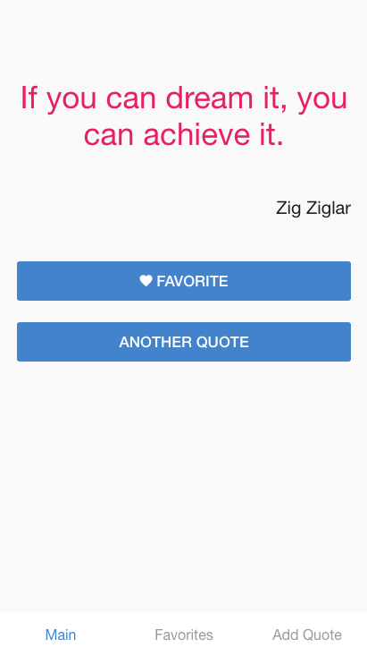

Inspire Application
==================
You have three pages:
 ## Main Page
It display a random quote from the quote database, with the two buttons:
 - **Favorite**: add this quote to favorites
 - **Another Quote**: show another random quote



## Favorite Quotes
Show the list of favorites quotes with the option to remove each quote from favorite.


## Submit a Quote
Save a new quote to the list of quotes, the quote object have two properties:
 - The quote text
 - The author

> **Quote Database**: Download the list of quotes from 
 https://raw.githubusercontent.com/formatech/materials/master/quotes-database.ts

## Hints
- Create a new phonegap project
- Remove unecessary stuff as we did before in the class
- Setup the tsconfig file
- Start by defining the Quote Service Api
- Create the pages with the navigation tabs
- The app should open on the main page by default
- The main page should show a random quote once opened

## Code Hint

### Get Random item
In JavaScript To get a random item from a database you can use the following method:

```js
function random(array) {
    return array[Math.floor(Math.random() * array.length)];
}
```

### Some jQuery methods
 
 #### Selection 
 ```js
    $('div') // select all <div> elements
    $('.item') // select elements that have the class *item* <div class="item">
    $('#item') // select elements that have the id *item* <p id="item">
    $('[size]') // select elements that have the attribute *size* <a size="12"> or <a size>
    $('[size=20]') // select elements that have the attribute *size* with the value of 20
 ```

 #### Manage Content and Html

 ```js
    // set html
    $('.item').html('This is the html <b>content</b>');

    // get html
    var html = $('.item').html();

    // create new jQuery object (dom reference)
    var $item = $('<div class="item">');

    // append element to the container
    $('#container').append($item)
 ```

 ## Bonus
Use a web api to fetch the quotes instead of using the local database
https://talaikis.com/api/quotes/random/


